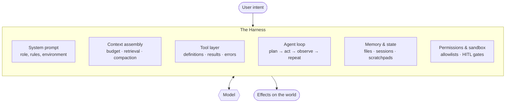

# Awesome AI Harness 

> The model is the engine. The **harness** is the car.

A curated list of resources on **harness engineering** — the discipline of building the runtime scaffolding that turns a language model into a working agent.

[中文版 →](README.zh-CN.md)

---

## Why this list

Most "awesome agent" lists catalogue *frameworks*. This one is about the layer underneath: the concrete engineering decisions that determine whether an agent works or flails.

A frontier model dropped into a bad harness behaves like a bad model. It loops, forgets, calls the wrong tool, burns its context on noise, and gives up. The same model in a good harness plans, recovers from errors, and finishes. **The gap between those two outcomes is harness engineering**, and almost none of it is in the model weights.

The craft is young, the knowledge is scattered across engineering blogs and leaked system prompts, and there is no textbook. This is an attempt at a map.

**Scope note:** this list covers the *inference-time* harness. Harnesses that double as RL training environments (environment hubs, trajectory generation, reward design) are a sibling discipline we deliberately leave out.

## What is a harness?

Everything between the user's intent and the model's next token:

The model is a stateless function. Every bit of statefulness, safety, memory, and competence an "agent" appears to have was engineered into the loop around it.

---

## Contents

- [Foundations](#foundations)
- [Context Engineering](#context-engineering)
- [Tool Design & Agent-Computer Interfaces](#tool-design--agent-computer-interfaces)
- [The Agent Loop](#the-agent-loop)
- [Memory, State & Session Resume](#memory-state--session-resume)
- [Multi-Agent & Orchestration](#multi-agent--orchestration)
- [Sandboxing & Runtime Isolation](#sandboxing--runtime-isolation)
- [Safety, Permissions & Human-in-the-Loop](#safety-permissions--human-in-the-loop)
- [Protocols & Interop](#protocols--interop)
- [Skills & Progressive Disclosure](#skills--progressive-disclosure)
- [Evaluation & Observability](#evaluation--observability)
- [Self-Improving Harnesses & Harness Optimization](#self-improving-harnesses--harness-optimization)
- [Reference Harnesses](#reference-harnesses)
- [Contributing & Extension Ecosystems](#contributing--extension-ecosystems)
- [Building Your Own](#building-your-own)
- [Talks, Courses & Community](#talks-courses--community)
- [Deep Dives in This Repo](#deep-dives-in-this-repo)
- [Contributing](#contributing)
- [License](#license)

---

## Foundations

Start here if you are new to the field.

- [Harness Engineering for Self-Improvement](https://lilianweng.github.io/posts/2026-07-04-harness/) — Lilian Weng. The most complete map of the discipline to date: three design patterns (workflow automation, filesystem-as-memory, sub-agents and backend jobs), a coding-agent case study, where the harness layer ends and core intelligence begins, and the case for harnesses that optimize themselves through evolutionary search. If you read one thing on this list, read this.
- [Building Effective Agents](https://www.anthropic.com/engineering/building-effective-agents) — Anthropic. The canonical starting point. Argues most "agents" should be workflows, and defines the vocabulary (chaining, routing, orchestrator-workers, evaluator-optimizer) the rest of the field now uses.
- [How to Build an Agent](https://ampcode.com/how-to-build-an-agent) — Thorsten Ball. A working code agent in ~300 lines. The single best cure for the belief that agents are magic; it is a loop, a list of tools, and good plumbing.
- [Agents](https://huyenchip.com/2025/01/07/agents.html) — Chip Huyen. Systematic breakdown of planning, tool use, and failure modes.
- [Don't Build Multi-Agents](https://cognition.ai/blog/dont-build-multi-agents) — Cognition. The dissenting case: context fragmentation across agents is the dominant failure mode. Read alongside the multi-agent section below.
- [A Practical Guide to Building Agents](https://cdn.openai.com/business-guides-and-resources/a-practical-guide-to-building-agents.pdf) — OpenAI (PDF).

### Terminology

The field's vocabulary is still settling; these pin it down.

- [Harness, Scaffold, and the AI Agent Terms Worth Getting Right](https://huggingface.co/blog/agent-glossary) — Hugging Face. The glossary that draws the harness/scaffold/framework lines, and bridges harness vocabulary to the RL-environment world.
- [Agent harness vs. agent framework](https://arize.com/blog/what-is-an-agent-harness-why-harnesses-are-replacing-agent-frameworks/) — Arize. Why "harness" is displacing "framework": the harness owns the loop, the framework only lends you parts.
- [Agent Engineering](https://www.latent.space/p/agent) — swyx. Names the job title and surveys its surface area, including the auth/identity layer most taxonomies forget.

### Design patterns & surveys

- [From Question Answering to Task Completion: A Survey on Agent System and Harness Design](https://arxiv.org/abs/2606.20683) — The academic survey of harness design proper; enumerates the six runtime responsibilities (session state, context budgeting, tool dispatch, provider abstraction, permissions, recovery) every harness must answer.
- [Agentic Design Patterns: A System-Theoretic Framework](https://arxiv.org/abs/2601.19752) — A pattern catalog that treats the harness as a system with feedback loops, not a prompt with plumbing.

## Context Engineering

The context window is the agent's entire working memory, and it is a scarce, actively-managed resource. This is where most harness quality lives.

- [Context Engineering for AI Agents: Lessons from Building Manus](https://manus.im/blog/Context-Engineering-for-AI-Agents-Lessons-from-Building-Manus) — Manus. The most-cited practitioner text on the subject: design around the KV-cache (stable prefix, append-only history), mask tool logits instead of removing tools, use the filesystem as unbounded context, recite goals into the recency window, and keep failures in context so the model learns from them.
- [Effective Context Engineering for AI Agents](https://www.anthropic.com/engineering/effective-context-engineering-for-ai-agents) — Anthropic. Treats context as a finite budget; covers just-in-time retrieval, compaction, and structured note-taking.
- [Context Rot: How Increasing Input Tokens Impacts LLM Performance](https://www.trychroma.com/research/context-rot) — Chroma. The measurement study: performance degrades non-uniformly as input grows, even on trivial tasks — the empirical case for everything else in this section.
- [Context Engineering](https://simonwillison.net/2025/Jun/27/context-engineering/) — Simon Willison. Short piece that popularized the term over "prompt engineering."
- [How Long Contexts Fail](https://www.dbreunig.com/2025/06/22/how-contexts-fail-and-how-to-fix-them.html) — Drew Breunig. Names four failure modes: poisoning, distraction, confusion, clash. Essential vocabulary.
- [How to Fix Your Context](https://www.dbreunig.com/2025/06/26/how-to-fix-your-context.html) — Drew Breunig. The companion remedies: RAG, tool loadout, quarantine, pruning, summarization, offloading.
- [A Survey of Context Engineering for Large Language Models](https://arxiv.org/abs/2507.13334) — The canonical academic formalization (note it defines the term far more broadly than practitioners do). [全文中文翻译](https://zhuanlan.zhihu.com/p/1934605504165950750) available on 知乎.
- [Lost in the Middle](https://arxiv.org/abs/2307.03172) — Why position in context matters, and why "just use a long context" fails.
- [Context Engineering for Agents](https://blog.langchain.com/context-engineering-for-agents/) — LangChain. The write/select/compress/isolate taxonomy.
- [The Rise of Context Engineering](https://blog.langchain.com/the-rise-of-context-engineering/) — LangChain.
- [Context Engineering — What it is, and techniques to consider](https://www.philschmid.de/context-engineering) — Philipp Schmid.
- [Managing Context on the Claude Developer Platform](https://www.anthropic.com/news/context-management) — Anthropic. Context editing and the memory tool as first-class API primitives.
- [Why Cline Doesn't Index Your Codebase](https://cline.bot/blog/why-cline-doesnt-index-your-codebase-and-why-thats-a-good-thing) — Cline. The case against RAG-for-code: agentic grep + read beats embeddings on freshness, security surface, and truthfulness.
- [Building a better repository map with tree-sitter](https://aider.chat/2023/10/22/repomap.html) — Aider. The opposite bet from Cline's: a compact, always-present structural map of the repo, built from AST symbols and ranked by graph centrality.
- [AI Agent 上下文工程：LangChain & Manus 研讨会全记录](https://liduos.com/posts/langchain-manus-agent-context-engineering-workshop) — 中文. LangChain × Manus workshop notes pairing the two teams' context strategies side by side.

## Tool Design & Agent-Computer Interfaces

Tools are the agent's API to reality. Their names, schemas, return values, and error messages are prompt engineering by another name — and the interface design is worth more than a model upgrade.

- [Writing Effective Tools for Agents](https://www.anthropic.com/engineering/writing-tools-for-agents) — Anthropic. The best single reference: consolidate tools, return token-efficient results, make errors instructive, namespace clearly.
- [SWE-agent: Agent-Computer Interfaces Enable Automated Software Engineering](https://arxiv.org/abs/2405.15793) — Coins "agent-computer interface" and shows interface design is worth more than model swaps. Arguably the foundational harness-engineering paper.
- [We removed 80% of our agent's tools](https://vercel.com/blog/we-removed-80-percent-of-our-agents-tools) — Vercel. The reduction experiment taken to its end: replace a wall of bespoke tools with a terminal and watch reliability go up.
- [Advanced Tool Use](https://www.anthropic.com/engineering/advanced-tool-use) — Anthropic. Programmatic tool calling, tool search, and parallel execution.
- [Code Execution with MCP](https://www.anthropic.com/engineering/code-execution-with-mcp) — Anthropic. Presenting tools as code APIs instead of direct calls, cutting token overhead dramatically at scale.
- [Code Mode: the better way to use MCP](https://blog.cloudflare.com/code-mode/) — Cloudflare. The same conclusion reached independently: agents write TypeScript against tool APIs in an isolate, because models are better at code than at tool-call JSON.
- [The "Think" Tool](https://www.anthropic.com/engineering/claude-think-tool) — Anthropic. A no-op tool that buys deliberation mid-loop. Elegant demonstration that tools shape cognition, not just capability.
- [Toolformer](https://arxiv.org/abs/2302.04761) — Where tool-use research started: models teaching themselves when to call APIs.
- [MCP Reference Servers](https://github.com/modelcontextprotocol/servers) — Read these as worked examples of tool schema design.

## The Agent Loop

- [ReAct: Synergizing Reasoning and Acting](https://arxiv.org/abs/2210.03629) — The loop nearly every harness still runs.
- [Executable Code Actions Elicit Better LLM Agents](https://arxiv.org/abs/2402.01030) — CodeAct. Actions as Python instead of JSON; composition and control flow come free.
- [Reflexion](https://arxiv.org/abs/2303.11366) — Verbal self-reflection as a substitute for weight updates.
- [Self-Refine](https://arxiv.org/abs/2303.17651) — Iterative self-critique.
- [Chain-of-Thought Prompting](https://arxiv.org/abs/2201.11903) — The pre-agent ancestor: reasoning as intermediate tokens.
- [Tree of Thoughts](https://arxiv.org/abs/2305.10601) — Search over reasoning paths instead of a single rollout.
- [Claude Code Best Practices](https://www.anthropic.com/engineering/claude-code-best-practices) — Anthropic. Explore→plan→code→commit, and why an agent that reads before writing outperforms one that doesn't.
- [Rebuilding Devin for Claude Sonnet 4.5](https://cognition.com/blog/devin-sonnet-4-5-lessons-and-challenges) — Cognition. Model-harness coupling in the wild: the same harness needed rework for a new model's "context anxiety" and tool-preference quirks — harnesses are becoming model-version-specific artifacts.
- [Interleaved Thinking Unlocks Reliable Agentic Capability](https://www.minimax.io/news/why-is-interleaved-thinking-important-for-m2) — MiniMax. Why the harness must preserve thinking blocks between turns, and what breaks when it doesn't.
- [Droid: #1 on Terminal-Bench](https://factory.ai/news/terminal-bench) — Factory. A harness team's account of what loop-level engineering (not model choice) bought them on a hard benchmark.
- [How I program with agents](https://crawshaw.io/blog/programming-with-agents) — David Crawshaw. A practitioner's honest account of the loop from the human side: what delegation actually feels like and where it breaks.
- [Antibrittle Agents](https://www.southbridge.ai/blog/antibrittle-agents) — Southbridge. Designing loops that degrade gracefully instead of shattering on the first unexpected state.

## Memory, State & Session Resume

- [MemGPT: Towards LLMs as Operating Systems](https://arxiv.org/abs/2310.08560) — Virtual-memory paging applied to the context window. The paper that made "memory hierarchy" the default frame.
- [Generative Agents](https://arxiv.org/abs/2304.03442) — Memory stream with recency/importance/relevance retrieval.
- [Letta](https://github.com/letta-ai/letta) — The MemGPT ideas as a working stateful-agent server.
- [Mem0](https://github.com/mem0ai/mem0) — Memory layer with extraction/consolidation pipelines; the [companion paper](https://arxiv.org/abs/2504.19413) reports strong latency and benchmark numbers (self-reported — treat vendor-run memory benchmarks with appropriate skepticism, here and everywhere).
- [Graphiti](https://github.com/getzep/graphiti) — Temporally-aware knowledge graphs as agent memory: facts carry validity intervals, so the memory can answer "what was true when."
- [Are We Ready For An Agent-Native Memory System?](https://arxiv.org/abs/2606.24775) — Argues bolted-on memory stores miss what agents actually need; a good map of the design space.
- [Crab: A Semantics-Aware Checkpoint/Restore Runtime for Agent Sandboxes](https://arxiv.org/abs/2604.28138) — Session resume as a systems problem: replaying chat history recovers only a fraction of crashed sessions; real resume needs runtime-level checkpointing.

## Multi-Agent & Orchestration

- [How We Built Our Multi-Agent Research System](https://www.anthropic.com/engineering/multi-agent-research-system) — Anthropic. Honest about the costs: token overhead, coordination failure, and where fan-out actually pays.
- [Don't Build Multi-Agents](https://cognition.ai/blog/dont-build-multi-agents) — Cognition. The strongest counterargument. Read both.
- [Why Do Multi-Agent LLM Systems Fail?](https://arxiv.org/abs/2503.13657) — MAST: the empirical failure taxonomy (specification, inter-agent misalignment, verification) that turns the multi-agent debate from opinion into data.
- [Towards a Science of Scaling Agent Systems](https://arxiv.org/abs/2512.08296) — When does adding agents help? Roughly: when the task decomposes and verification is centralized — the honest synthesis of both camps above.

## Sandboxing & Runtime Isolation

If your harness can run commands, it can run *bad* commands. The 2025-26 convergence: both major labs independently arrived at the same two-plane design — filesystem isolation plus a domain-allowlist egress proxy.

- [sandbox-runtime](https://github.com/anthropic-experimental/sandbox-runtime) — Anthropic. The open reference implementation of that two-plane design.
- [Making Claude Code more secure and autonomous through sandboxing](https://www.anthropic.com/engineering/claude-code-sandboxing) — Anthropic. The companion post: proper sandboxing cut permission prompts by 84% — isolation *buys* autonomy rather than restricting it.
- [How we contain Claude](https://www.anthropic.com/engineering/how-we-contain-claude) — Anthropic. Containment across products, one level up from a single harness.
- [Codex sandboxing](https://github.com/openai/codex/blob/main/docs/sandbox.md) — OpenAI. The other lab's answer: Seatbelt on macOS, Landlock on Linux — worth reading side by side with Anthropic's.
- [A deep dive on agent sandboxes](https://pierce.dev/notes/a-deep-dive-on-agent-sandboxes) — Pierce Freeman. The taxonomy of isolation technologies (containers, gVisor, Firecracker, V8 isolates) from a harness builder's seat.
- [Iterating with shadow workspaces](https://cursor.com/blog/shadow-workspace) — Cursor. Isolation for a different reason: a hidden copy of the workspace where the agent can break things while getting real LSP feedback.
- [E2B](https://github.com/e2b-dev/E2B) — Sandboxed cloud runtimes for agent-generated code.
- [microsandbox](https://github.com/microsandbox/microsandbox) — Self-hosted microVM isolation with sub-200ms boot; the middle ground between containers-too-weak and VMs-too-slow.
- [Modal Sandboxes](https://modal.com/docs/guide/sandbox) — Sandboxing as a serverless primitive; notable for making per-run isolation cheap enough to be the default.
- [Cua](https://github.com/trycua/cua) — Sandbox-per-run for computer-use agents: ephemeral macOS/Linux/Windows VMs that reset on every run, so agents are reproducible and the host stays untouched.
- [Daytona](https://github.com/daytonaio/daytona) — Sandbox infrastructure purpose-built for agent workloads. Note: the open-source repo stopped receiving updates in mid-2026; evaluate accordingly.

## Safety, Permissions & Human-in-the-Loop

- [The Lethal Trifecta](https://simonwillison.net/2025/Jun/16/the-lethal-trifecta/) — Simon Willison. Private data + untrusted content + external communication = exfiltration. The clearest threat model in the field.
- [Prompt Injection series](https://simonwillison.net/series/prompt-injection/) — Simon Willison. Years of accumulated attacks and why filtering does not work.
- [Design Patterns for Securing LLM Agents against Prompt Injections](https://arxiv.org/abs/2506.08837) — Six concrete architectural patterns with real trade-offs.
- [Defeating Prompt Injections by Design](https://arxiv.org/abs/2503.18813) — CaMeL: the out-of-band defense — deterministic policy code and capability labels outside the model, quarantined interpreters inside. The consensus direction after filtering failed.
- [AgentDojo](https://arxiv.org/abs/2406.13352) — The attack benchmark the defenses above are measured on; a harness security section without it is defenses with no scoreboard.
- [Auditing Agent Harness Safety](https://arxiv.org/abs/2605.14271) — HarnessAudit: trajectory-level auditing of what harnesses actually let through, as opposed to what their docs claim.
- [Magentic-UI: Towards Human-in-the-loop Agentic Systems](https://arxiv.org/abs/2507.22358) — Microsoft. Six concrete HITL mechanisms (co-planning, co-tasking, action guards…) as reusable design patterns, not ad-hoc confirm dialogs.
- [OWASP Top 10 for LLM Applications](https://owasp.org/www-project-top-10-for-large-language-model-applications/) — The checklist to review your harness against.
- [mcp-scan](https://github.com/invariantlabs-ai/mcp-scan) — Invariant Labs. Scanner for tool poisoning and rug-pull attacks in MCP servers; their study found poisoned metadata in a meaningful share of public servers — scan before you mount.
- [HumanLayer](https://github.com/humanlayer/humanlayer) — Human-in-the-loop approval as infrastructure.
- [Claude Code Security Review](https://github.com/anthropics/claude-code-security-review) — Agentic security review as a GitHub Action.

Known gap we're tracking: agent identity, OAuth for tools, credential brokering, and secrets management — the auth layer of harness engineering has surprisingly little public writing. Contributions welcome.

## Protocols & Interop

The clearest structural story of 2026: the harness is decomposing into standardized interfaces — MCP for tools, ACP for editors, skills for procedures, AGENTS.md for repo conventions.

- [Model Context Protocol](https://modelcontextprotocol.io) — The standard for wiring tools and data into harnesses.
- [Official MCP Registry](https://github.com/modelcontextprotocol/registry) — The namespace and discovery layer the ecosystem consolidated on.
- [One Year of MCP](https://blog.modelcontextprotocol.io/posts/2025-11-25-first-mcp-anniversary/) — The anniversary/spec-release post: what the protocol learned in production during its first year.
- [Agent Client Protocol](https://github.com/zed-industries/agent-client-protocol) — Zed. LSP for agents: a JSON-RPC protocol that lets any agent run inside any editor without point-to-point integrations.
- [agents.md](https://agents.md/) — The cross-vendor push to standardize per-repo agent instruction files.
- [AGENT.md](https://ampcode.com/AGENT.md) — The convention that started it.
- [ContextForge MCP Gateway](https://github.com/IBM/mcp-context-forge) — IBM. The enterprise pattern: federate many MCP servers behind one gateway with central auth and audit.

## Skills & Progressive Disclosure

Loading every instruction upfront wastes context. Loading them on demand is a harness pattern in its own right.

- [Equipping Agents for the Real World with Agent Skills](https://www.anthropic.com/engineering/equipping-agents-for-the-real-world-with-agent-skills) — Anthropic. The design rationale for progressive disclosure.
- [Agent Skills documentation](https://docs.claude.com/en/docs/agents-and-tools/agent-skills/overview) — Anthropic. The format spec: frontmatter, bundled scripts, and what triggers loading.
- [anthropics/skills](https://github.com/anthropics/skills) — Reference skill implementations.
- [Superpowers](https://github.com/obra/superpowers) — Jesse Vincent. An opinionated skill library that treats process discipline itself as an installable capability.
- [skills.sh](https://www.skills.sh/) — Vercel Labs. The cross-harness skills directory; useful both as a registry and as a corpus of examples.
- [OpenHands Skills](https://docs.openhands.dev/overview/skills) — The same progressive-disclosure idea in a second major harness — evidence the pattern is a standard, not a vendor feature.
- [Voyager](https://arxiv.org/abs/2305.16291) — The research ancestor: skill libraries that compose over time.

## Evaluation & Observability

You cannot tune a harness you cannot measure. Trajectory-level evaluation is a distinct problem from model benchmarking — and the benchmarks themselves are now under audit. This section holds the anchors; the full treatment lives in our sibling list, [awesome-agent-eval](https://github.com/Vendredi218/awesome-agent-eval).

- [Your AI Product Needs Evals](https://hamel.dev/blog/posts/evals/) — Hamel Husain. The best practical writing on building an eval loop that survives contact with production.
- [Creating a LLM-as-a-Judge That Drives Business Results](https://hamel.dev/blog/posts/llm-judge/) — Hamel Husain.
- [Holistic Agent Leaderboard](https://arxiv.org/abs/2510.11977) — HAL, Princeton. Three-dimensional evaluation (model × harness × task) showing scaffold choice changes model *rankings* — the empirical heart of why this list exists.
- [Establishing Best Practices for Building Rigorous Agentic Benchmarks](https://arxiv.org/abs/2507.02825) — ABC: the checklist exposing how many published agent benchmarks have broken verifiers.

### Benchmarks

- [SWE-bench](https://arxiv.org/abs/2310.06770) — The benchmark that made harness quality legible; scores move on scaffolding alone.
- [SWE-Bench Pro](https://arxiv.org/abs/2509.16941) — The long-horizon, contamination-resistant successor.
- [Terminal-Bench](https://arxiv.org/abs/2601.11868) — Hard realistic terminal tasks; the shared substrate of the harness-optimization literature (229 community-contributed tasks and counting).
- [τ-bench](https://arxiv.org/abs/2406.12045) — Tool-agent-user interaction with real domain rules.
- [τ²-bench](https://arxiv.org/abs/2506.07982) — The dual-control extension: user and agent both act on the environment.
- [ARE: Scaling Up Agent Environments and Evaluations](https://arxiv.org/abs/2509.17158) — Meta. Gaia2 and the environment-as-infrastructure thesis.
- [GAIA](https://arxiv.org/abs/2311.12983) — The general-assistant benchmark: trivial for humans, brutal for agents.
- [OSWorld](https://arxiv.org/abs/2404.07972) — The reference benchmark for computer-use harnesses in real desktop environments.
- [WebArena](https://arxiv.org/abs/2307.13854) — Realistic web environments; the browser-harness ancestor.
- [AgentBench](https://arxiv.org/abs/2308.03688) — The early multi-environment sweep.

### Tracing & observability

- [OpenTelemetry GenAI Semantic Conventions](https://github.com/open-telemetry/semantic-conventions-genai) — The emerging vendor-neutral standard for agent traces; instrument to this, not to a vendor SDK.
- [OpenInference](https://github.com/Arize-ai/openinference) — The OTel-compatible instrumentation spec Phoenix and friends speak.
- [Langfuse](https://github.com/langfuse/langfuse) — Open-source LLM tracing and evals.
- [Arize Phoenix](https://github.com/Arize-ai/phoenix) — Tracing and evaluation for agent traces.
- [Braintrust](https://www.braintrust.dev/docs) — Evals-as-CI: the loop of log → dataset → experiment → regression gate.

## Self-Improving Harnesses & Harness Optimization

The optimization target migrated: first prompts, then scaffolds, now the harness as a named artifact. This is the most forward-looking section of the list — and the least settled.

- [Darwin Gödel Machine](https://arxiv.org/abs/2505.22954) — Sakana/UBC. Agents that rewrite their own harness code, validated empirically on coding benchmarks rather than by proof. The line of work Lilian Weng's post builds toward.
- [Automated Design of Agentic Systems](https://arxiv.org/abs/2408.08435) — ADAS: the origin paper — search over agent designs in code space, meta-agent programming new agents.
- [GEPA: Reflective Prompt Evolution Can Outperform Reinforcement Learning](https://arxiv.org/abs/2507.19457) — Language-native evolution: reflect on trajectories in prose, mutate the harness's text genome, outperform RL with 35× fewer rollouts.
- [Agentic Context Engineering](https://arxiv.org/abs/2510.04618) — ACE: contexts that improve themselves via incremental structured playbook updates, and why naive summarize-and-replace causes context collapse.
- [AlphaEvolve](https://arxiv.org/abs/2506.13131) — DeepMind. Evolutionary search over code with LLM mutation operators — the pattern harness optimization borrows.
- [Self-Harness: Harnesses That Improve Themselves](https://arxiv.org/abs/2606.09498) — The direct application: the harness observes its own failures and patches its own scaffolding.
- [Agentic Harness Engineering: Observability-Driven Automatic Evolution](https://arxiv.org/abs/2604.25850) — Closes the loop between the tracing stack and harness mutation: traces in, harness patches out.
- [HARBOR: Automated Harness Optimization](https://arxiv.org/abs/2604.20938) — Benchmark-driven harness search. (Not to be confused with Harbor, the terminal-bench task format.)

## Reference Harnesses

Read the source. This is the fastest way to learn the craft.

### Coding agents

- [Claude Code](https://github.com/anthropics/claude-code) — Anthropic's coding agent.
- [Codex CLI](https://github.com/openai/codex) — OpenAI's, in Rust.
- [Gemini CLI](https://github.com/google-gemini/gemini-cli) — Google's, Apache-2.0.
- [Aider](https://github.com/Aider-AI/aider) — Mature, with unusually rigorous repo-map and edit-format engineering.
- [OpenHands](https://github.com/All-Hands-AI/OpenHands) — Research-grade, fully open, strong sandboxing story.
- [SWE-agent](https://github.com/SWE-agent/SWE-agent) — The ACI paper as running code.
- [mini-swe-agent](https://github.com/SWE-agent/mini-swe-agent) — The same team's ~100-line counterpoint: bash as the only tool, no tool-calling API, yet >74% on SWE-bench Verified with a frontier model driving it. The sharpest datapoint in the minimalism debate.
- [Cline](https://github.com/cline/cline) — VS Code agent with an explicit plan/act split.
- [Kilo Code](https://github.com/Kilo-Org/kilocode) — The surviving branch of the Cline→Roo fork lineage (Roo Code was archived in 2026), with user-defined agent modes carrying scoped tool access.
- [OpenCode](https://github.com/sst/opencode) — Terminal agent, provider-agnostic.
- [Crush](https://github.com/charmbracelet/crush) — Charm. The LSP-as-context bet: feed the model language-server data the way an IDE feeds a human. Note the FSL-1.1-MIT license — source-available, converts to MIT after two years.
- [Qwen Code](https://github.com/QwenLM/qwen-code) — Alibaba. A case study in porting a harness across model families: a gemini-cli fork whose prompts and function-calling parser were rewritten for Qwen3-Coder — instructive for seeing which layers of a CLI are model-specific.
- [Trae Agent](https://github.com/bytedance/trae-agent) — ByteDance. Research-oriented coding agent with an ablation-friendly modular design.
- [Goose](https://github.com/block/goose) — Block's extensible on-machine agent.
- [Continue](https://github.com/continuedev/continue) — Building blocks for custom in-IDE assistants.
- [DeepSeek Harness (dsh)](https://github.com/deepseek-ai/deepseek-harness) — Everything is a plugin, including the agent loop itself. There is deliberately no privileged core; the shipped coding agent is just one composition of swappable parts.
- [Pi](https://github.com/earendil-works/pi) — The minimalist counterpoint: a thin core of four tools (`read`, `write`, `edit`, `bash`) on the bet that frontier models already know what a coding agent is. Everything else lives in extensions you add deliberately.

### Personal agents

- [OpenClaw](https://github.com/openclaw/openclaw) — The fastest-adopted harness in open-source history (380k+ stars within months of its late-2025 debut): local gateway control plane, messaging apps as the UI, memory as plain Markdown files, a heartbeat daemon for unprompted action.
- [Hermes Agent](https://github.com/NousResearch/hermes-agent) — Nous Research. Harness-level self-improvement in practice: agent-curated memory, autonomous creation of reusable skills after complex tasks, full-text session search.

### Browser & computer use

- [browser-use](https://github.com/browser-use/browser-use) — The dominant open browser harness: serialize the DOM into structured text with indexed interactive elements, so any LLM can act without vision.
- [Stagehand](https://github.com/browserbase/stagehand) — Browserbase. Three primitives (act/observe/extract) over a Playwright-style API; choose per step between deterministic code and natural language, with caching and self-healing.
- [Skyvern](https://github.com/Skyvern-AI/skyvern) — The vision-first counterpoint: vision LLMs plan over screenshots so automations survive site redesigns. AGPL-3.0 core with some capabilities held back for the proprietary cloud — a licensing pattern worth noticing.
- [Agent QA](https://github.com/vostride/agent-qa) — A TypeScript application-QA harness showing how persistent test memory, self-healing web/mobile flows, MCP tools, and evidence-backed failure triage fit into one runtime. Note the FSL-1.1-ALv2 license — source-available, converts to Apache-2.0 after two years.

### Deep research

- [GPT Researcher](https://github.com/assafelovic/gpt-researcher) — The longest-lived open deep-research harness: planner → parallel executors → publisher, with citation tracking throughout.
- [Open Deep Research](https://github.com/langchain-ai/open_deep_research) — LangChain. Uniquely instructive because the repo preserves its own architectural evolution — three generations of deep-research design live side by side in one codebase.

### Voice

- [Pipecat](https://github.com/pipecat-ai/pipecat) — The open standard for voice-agent orchestration: real-time pipelines where latency budgets, interruption handling, and turn-taking are the harness problems.
- [LiveKit Agents](https://github.com/livekit/agents) — The WebRTC-native alternative; read both to see how transport constraints reshape the agent loop.
- [Voice AI & Voice Agents: An Illustrated Primer](https://voiceaiandvoiceagents.com/) — The field guide to why voice harnesses are their own discipline.

### SDKs & runtimes

- [LangGraph](https://github.com/langchain-ai/langgraph) — Graph-structured orchestration with explicit state.
- [OpenAI Agents SDK](https://github.com/openai/openai-agents-python) — Handoffs, guardrails, and tracing as primitives.
- [Pydantic AI](https://github.com/pydantic/pydantic-ai) — Type-safe agents; strong schema discipline.
- [smolagents](https://github.com/huggingface/smolagents) — Hugging Face. The reference implementation of code-as-action in ~1,000 lines; agents emit Python instead of JSON tool calls, executed in pluggable sandboxes.
- [Google ADK](https://github.com/google/adk-python) — Code-first agent SDK with a graph workflow runtime: routing, fan-out/fan-in, loops, retry, HITL tool confirmation.
- [Strands Agents](https://github.com/strands-agents/harness-sdk) — AWS. Literally named "harness-sdk": build an agent harness and control it end-to-end, any model, any cloud.
- [AgentScope](https://github.com/agentscope-ai/agentscope) — Alibaba. Notable for real-time interruption and steering mid-loop as first-class primitives.
- [Youtu-Agent](https://github.com/TencentCloudADP/youtu-agent) — Tencent. Async simple-agent harness tuned for strong benchmark results with open-weight models.

### Comparative reading

- [DeepSeek Harness: Everything Is a Plugin](https://saikodev.ai/blog/deepseek-harness) — SaikoDev. A hands-on dsh walkthrough that turns into the sharpest architectural comparison available: dsh versus Pi as two opposite bets — structured addition against subtraction, and whether control over extending the system belongs to the developer ahead of time or to the agent at runtime.
- [How Claude Code is built](https://newsletter.pragmaticengineer.com/p/how-claude-code-is-built) — Pragmatic Engineer. The team's own account: TypeScript, aggressive dogfooding, and the harness rewritten by the agent it hosts.

## Contributing & Extension Ecosystems

How to actually get involved — the fastest way to learn harness engineering is to extend one. Full guide: [Contributing to Open-Source Harnesses](docs/contributing-to-open-harnesses.md).

The governance split that determines your strategy: **core-open** projects (OpenHands, Cline, Continue, Gemini CLI, Goose, Aider) take engine PRs; **ecosystem-first** projects (Claude Code, dsh, Codex) want you building on the extension surface instead.

- [Claude Code: Create plugins](https://code.claude.com/docs/en/plugins) — Plugin format, `claude plugin validate`, and the community marketplace pipeline.
- [Gemini CLI: Extensions](https://google-gemini.github.io/gemini-cli/docs/extensions/) — Google's extension format and publication flow.
- [dsh: Cordis plugin tutorial](https://deepseek-harness.github.io/deepseek-harness/en/develop/cordis-tutorial/) — The deepest plugin API of any harness: DI, typed events, hot module reload. Pair with the [CONTRIBUTING.md](https://github.com/deepseek-ai/deepseek-harness/blob/master/CONTRIBUTING.md) for the closed-core/open-ecosystem policy.
- [Pi: extensions.md](https://github.com/earendil-works/pi/blob/main/packages/coding-agent/docs/extensions.md) — The event surface (`session_before_compact`, `before_provider_request`…) that makes Pi the best small harness to learn loop internals on.
- [Cline: Plugins](https://docs.cline.bot/sdk/plugins) — The `AgentPlugin` hook-policy design (blocking/async, timeouts, failure modes) — the study text for safely running third-party code inside a loop.
- [Codex: contributing policy](https://github.com/openai/codex/blob/main/docs/contributing.md) — The invited-PR model, stated plainly: root-cause analysis in an issue thread is the contribution they want.
- [OpenHands: extensions registry](https://github.com/OpenHands/extensions) — Lowest-friction real PR in the field: a SKILL.md directory plus one JSON entry.
- [Goose: Building custom extensions](https://goose-docs.ai/docs/tutorials/custom-extensions) — A Goose extension *is* an MCP server — the clearest demonstration that MCP is the cross-harness lingua franca.
- [Continue: customization](https://docs.continue.dev/customize/overview) — Blocks: models, rules, tools and prompts as shareable units on a hub.
- [Harbor task format](https://harborframework.com/docs/task-format) — How to contribute a terminal-bench task: instruction + Dockerized environment + verifier + oracle solution. Verification design as a contributable craft.
- [cline-bench](https://cline.ghost.io/cline-bench-initiative/) — Benchmark tasks harvested from real failure trajectories — contribute the task that broke your agent.
- [awesome-deepseek-harness](https://github.com/libukai/awesome-deepseek-harness) — 中文. The dsh ecosystem map, and the best worked example of a community growing around a plugin registry.

## Building Your Own

- [12-Factor Agents](https://github.com/humanlayer/12-factor-agents) — Dex Horthy. The closest thing the field has to a harness design checklist, distilled from ~100 production teams. Own your context window; own your control flow.
- [Claude Agent SDK (Python)](https://github.com/anthropics/claude-agent-sdk-python) — The Claude Code harness as a library.
- [Claude Agent SDK (TypeScript)](https://github.com/anthropics/claude-agent-sdk-typescript)
- [Agent Harness concepts](https://learn.microsoft.com/en-us/agent-framework/concepts/harness) — Microsoft. A vendor shipping "harness" as a product concept, with a capability matrix (approval modes, checkpointing, isolation…) that doubles as a build checklist.
- [Inside the Scaffold: A Source-Code Taxonomy of Coding Agent Architectures](https://arxiv.org/abs/2604.03515) — Reads the actual source of the major coding agents and maps the design space you're about to enter.
- [What I learned building an opinionated and minimal coding agent](https://mariozechner.at/posts/2025-11-30-pi-coding-agent/) — Mario Zechner. The Pi retrospective: every feature that didn't survive contact with reality, and why.
- [Anthropic Cookbook](https://github.com/anthropics/anthropic-cookbook) — Runnable patterns.
- [OpenAI Cookbook](https://github.com/openai/openai-cookbook)
- [LiteLLM](https://github.com/BerriAI/litellm) — One interface across providers; useful for harness-level A/B tests.
- [System Prompts and Models of AI Tools](https://github.com/x1xhlol/system-prompts-and-models-of-ai-tools) — Collected system prompts from shipping products. Primary sources, unmatched for studying real harness design.
- [Decoding Claude Code](https://minusx.ai/blog/decoding-claude-code/) — MinusX. Close reading of a production harness.

## Talks, Courses & Community

### Talks

- [12-Factor Agents](https://www.youtube.com/watch?v=8kMaTybvDUw) — Dex Horthy, AI Engineer World's Fair. The talk version of the checklist above.
- [Claude Code & the evolution of agentic coding](https://www.youtube.com/watch?v=Lue8K2jqfKk) — Boris Cherny, AI Engineer World's Fair. The harness's author on its design decisions.
- [How We Build Effective Agents](https://www.youtube.com/watch?v=D7_ipDqhtwk) — Barry Zhang, AI Engineer Summit. The companion talk to Anthropic's canonical post.
- [Don't Build Agents, Build Skills Instead](https://www.youtube.com/watch?v=CEvIs9y1uog) — Barry Zhang & Mahesh Murag, Anthropic. The progressive-disclosure argument, argued live.
- [Building pi in a World of Slop](https://www.youtube.com/watch?v=RjfbvDXpFls) — Mario Zechner, AI Engineer Europe. Minimalism as an engineering discipline.
- [Raising an Agent](https://ampcode.com/podcast) — Amp. A podcast series that is effectively a longitudinal diary of building one harness.

### Courses

- [Hugging Face Agents Course](https://huggingface.co/learn/agents-course/en/unit0/introduction) — The broadest free curriculum; framework-agnostic fundamentals first.
- [AI Agents for Beginners](https://github.com/microsoft/ai-agents-for-beginners) — Microsoft. 十余节课, 有中文版; the gentlest on-ramp.
- [Hello-Agents 《从零开始构建智能体》](https://github.com/datawhalechina/hello-agents) — Datawhale. 中文社区最系统的智能体课程 (70k+ ⭐) — build the harness from scratch, in Chinese.
- [MCP: Build Rich-Context AI Apps with Anthropic](https://www.deeplearning.ai/courses/mcp-build-rich-context-ai-apps-with-anthropic/) — DeepLearning.AI. Short course on the tool-protocol layer.
- [Context-Engineering](https://github.com/davidkimai/Context-Engineering) — David Kim. A first-principles handbook treating the context window the way an OS course treats memory.

### Community & adjacent lists

- [awesome-agent-eval](https://github.com/Vendredi218/awesome-agent-eval) — Our sibling list: the measuring half — agent benchmarks and their pathologies, verifier design, LLM-as-judge, production eval loops.
- [AI Engineer](https://www.youtube.com/@aiDotEngineer) — The conference channel; the densest single archive of harness-engineering talks.
- [Latent Space](https://www.latent.space/) — The podcast/newsletter of record for the agent-engineering beat.
- [MCP community channels](https://modelcontextprotocol.io/community/communication) — Where the protocol actually gets decided (SEPs, working groups).
- [awesome-mcp-servers](https://github.com/punkpeye/awesome-mcp-servers) — The MCP server catalog; we cover the protocol layer, they cover the inventory.
- [awesome-claude-code](https://github.com/hesreallyhim/awesome-claude-code) — Single-harness deep inventory; we stay cross-harness.
- [awesome-ai-agents](https://github.com/e2b-dev/awesome-ai-agents) — The broad agent-product catalog; we stay on the scaffolding layer.

---

## Deep Dives in This Repo

Longer notes that synthesize the above rather than just linking it:

- [Context Engineering](docs/context-engineering.md) · [中文](docs/context-engineering.zh-CN.md)
- [Tool Design](docs/tool-design.md) · [中文](docs/tool-design.zh-CN.md)
- [Contributing to Open-Source Harnesses](docs/contributing-to-open-harnesses.md) · [中文](docs/contributing-to-open-harnesses.zh-CN.md)

**Planned:** the agent loop · memory & state · multi-agent orchestration · sandboxing · safety & HITL · evaluation. [Contributions welcome.](CONTRIBUTING.md)

---

## Contributing

Read [CONTRIBUTING.md](CONTRIBUTING.md). The bar: it must teach something about **building the scaffolding**, not about prompting a chatbot or training a model. Every entry needs a sentence saying what you actually learn from it.

## License

[CC0 1.0](LICENSE) — public domain.
