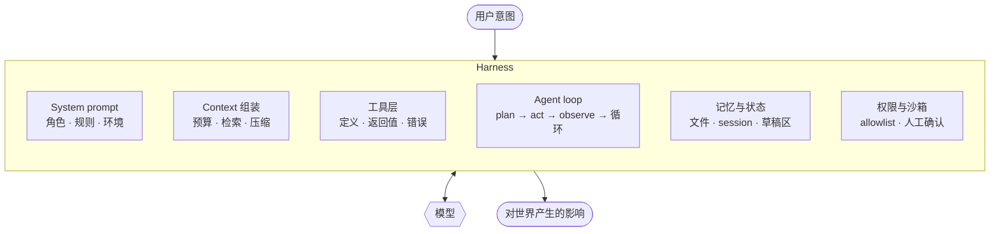

# Awesome AI Harness 

> 模型是引擎，**harness** 是整辆车。

关于 **harness engineering**（智能体运行时脚手架工程）的资源精选 —— 即把一个语言模型变成一个能干活的 agent 所需要的全部工程。

[English →](README.md)

---

## 为什么做这个列表

大部分 "awesome agent" 列表收集的是 *framework*。这个列表关注的是更底层的一层：那些真正决定 agent 是能干活还是原地打转的具体工程决策。

把一个前沿模型放进糟糕的 harness，它的表现就像一个糟糕的模型：死循环、遗忘、调错工具、把 context 烧在噪音上，然后放弃。同一个模型放进好的 harness，它会规划、会从错误中恢复、会把事情做完。**这两种结果之间的差距就是 harness engineering**，而它几乎完全不在模型权重里。

这门手艺还很年轻，知识散落在各家的工程博客和泄露的 system prompt 里，没有教科书。这个仓库试着画一张地图。

**范围说明：**这个列表只覆盖*推理时*的 harness。那些兼作 RL 训练环境的 harness（environment hub、轨迹生成、reward 设计）是一门亲缘学科，我们刻意不收。

## 什么是 harness？

用户意图和模型下一个 token 之间的一切：

模型是一个无状态函数。一个 "agent" 看起来具备的所有状态、安全性、记忆和能力，都是被工程化进它外面那个循环里的。

---

## 目录

- [基础入门](#基础入门)
- [Context Engineering](#context-engineering)
- [工具设计与 Agent-Computer Interface](#工具设计与-agent-computer-interface)
- [Agent Loop](#agent-loop)
- [记忆、状态与 Session Resume](#记忆状态与-session-resume)
- [多 Agent 与编排](#多-agent-与编排)
- [沙箱与运行时隔离](#沙箱与运行时隔离)
- [安全、权限与 Human-in-the-Loop](#安全权限与-human-in-the-loop)
- [协议与互操作](#协议与互操作)
- [Skills 与渐进式披露](#skills-与渐进式披露)
- [评估与可观测性](#评估与可观测性)
- [自我改进的 Harness 与 Harness 优化](#自我改进的-harness-与-harness-优化)
- [可参考的 Harness 实现](#可参考的-harness-实现)
- [贡献与 Extension 生态](#贡献与-extension-生态)
- [自己动手做一个](#自己动手做一个)
- [演讲、课程与社区](#演讲课程与社区)
- [本仓库的深度笔记](#本仓库的深度笔记)
- [贡献](#贡献)
- [许可](#许可)

---

## 基础入门

刚入门从这里开始。

- [Harness Engineering for Self-Improvement](https://lilianweng.github.io/posts/2026-07-04-harness/) —— Lilian Weng。目前对这门学科最完整的一张地图：三种设计模式（workflow 自动化、文件系统作为记忆、sub-agent 与后台任务）、一个 coding agent 案例研究、harness 层与核心智能的边界在哪，以及关于「harness 通过演化搜索自我优化」的论证。整个列表只读一篇的话，读这篇。
- [Building Effective Agents](https://www.anthropic.com/engineering/building-effective-agents) —— Anthropic。公认的起点。核心观点是大部分所谓 "agent" 其实应该是 workflow，并定义了这个领域现在通用的词汇表（chaining、routing、orchestrator-workers、evaluator-optimizer）。
- [How to Build an Agent](https://ampcode.com/how-to-build-an-agent) —— Thorsten Ball。用大约 300 行代码写一个能用的 coding agent。治疗"agent 很玄"这种幻觉的最好药方：它就是一个循环、一组工具，加上扎实的工程。
- [Agents](https://huyenchip.com/2025/01/07/agents.html) —— Chip Huyen。系统性地拆解 planning、tool use 和失败模式。
- [Don't Build Multi-Agents](https://cognition.ai/blog/dont-build-multi-agents) —— Cognition。反方观点：跨 agent 的 context 割裂是最主要的失败来源。建议和下面的多 agent 章节对照着读。
- [A Practical Guide to Building Agents](https://cdn.openai.com/business-guides-and-resources/a-practical-guide-to-building-agents.pdf) —— OpenAI（PDF）。

### 术语

这个领域的词汇还没定型，这几篇把它们钉住了。

- [Harness, Scaffold, and the AI Agent Terms Worth Getting Right](https://huggingface.co/blog/agent-glossary) —— Hugging Face。把 harness / scaffold / framework 之间的边界划清楚的那份词汇表，还顺手把 harness 词汇接到了 RL 环境那个世界。
- [Agent harness vs. agent framework](https://arize.com/blog/what-is-an-agent-harness-why-harnesses-are-replacing-agent-frameworks/) —— Arize。为什么 "harness" 正在取代 "framework"：harness 拥有整个循环，framework 只是借你几个零件。
- [Agent Engineering](https://www.latent.space/p/agent) —— swyx。给这个职位起了名字，并盘点了它的工作面，包括大多数分类法都会漏掉的 auth/identity 层。

### 设计模式与综述

- [From Question Answering to Task Completion: A Survey on Agent System and Harness Design](https://arxiv.org/abs/2606.20683) —— 真正针对 harness 设计本身的学术综述；列举了每个 harness 都绕不开的六项运行时职责（session 状态、context 预算、tool 分发、provider 抽象、权限、恢复）。
- [Agentic Design Patterns: A System-Theoretic Framework](https://arxiv.org/abs/2601.19752) —— 一份把 harness 当成带反馈回路的系统、而不是"prompt 加管道"来看待的模式目录。

## Context Engineering

Context window 就是 agent 的全部工作记忆，而且是一种稀缺的、需要主动管理的资源。harness 的质量大部分体现在这里。

- [Context Engineering for AI Agents: Lessons from Building Manus](https://manus.im/blog/Context-Engineering-for-AI-Agents-Lessons-from-Building-Manus) —— Manus。这个主题被引用最多的实践者文本：围绕 KV-cache 做设计（稳定前缀、append-only 历史）、mask 工具 logits 而不是移除工具、把文件系统当作无限 context、把目标复诵进 recency window，以及把失败留在 context 里让模型吸取教训。
- [Effective Context Engineering for AI Agents](https://www.anthropic.com/engineering/effective-context-engineering-for-ai-agents) —— Anthropic。把 context 当作有限预算来管理；覆盖 just-in-time 检索、compaction 和结构化笔记。
- [Context Rot: How Increasing Input Tokens Impacts LLM Performance](https://www.trychroma.com/research/context-rot) —— Chroma。测量型研究：输入越长，性能就以不均匀的方式退化，连最简单的任务也不例外 —— 本节其他所有内容的实证依据。
- [Context Engineering](https://simonwillison.net/2025/Jun/27/context-engineering/) —— Simon Willison。让这个词取代 "prompt engineering" 的那篇短文。
- [How Long Contexts Fail](https://www.dbreunig.com/2025/06/22/how-contexts-fail-and-how-to-fix-them.html) —— Drew Breunig。命名了四种失败模式：poisoning、distraction、confusion、clash。非常有用的词汇表。
- [How to Fix Your Context](https://www.dbreunig.com/2025/06/26/how-to-fix-your-context.html) —— Drew Breunig。上一篇的解药：RAG、tool loadout、quarantine、pruning、summarization、offloading。
- [A Survey of Context Engineering for Large Language Models](https://arxiv.org/abs/2507.13334) —— 这个方向的标准学术形式化（注意它对这个词的定义比实践者宽泛得多）。知乎有[全文中文翻译](https://zhuanlan.zhihu.com/p/1934605504165950750)。
- [Lost in the Middle](https://arxiv.org/abs/2307.03172) —— 为什么信息在 context 中的位置很重要，以及为什么"直接上长 context"不管用。
- [Context Engineering for Agents](https://blog.langchain.com/context-engineering-for-agents/) —— LangChain。write / select / compress / isolate 四分法。
- [The Rise of Context Engineering](https://blog.langchain.com/the-rise-of-context-engineering/) —— LangChain。
- [Context Engineering — What it is, and techniques to consider](https://www.philschmid.de/context-engineering) —— Philipp Schmid。
- [Managing Context on the Claude Developer Platform](https://www.anthropic.com/news/context-management) —— Anthropic。把 context editing 和 memory tool 做成 API 一等公民。
- [Why Cline Doesn't Index Your Codebase](https://cline.bot/blog/why-cline-doesnt-index-your-codebase-and-why-thats-a-good-thing) —— Cline。反对"给代码上 RAG"的论证：agentic 的 grep + read 在新鲜度、安全面和真实性上全面胜过 embeddings。
- [Building a better repository map with tree-sitter](https://aider.chat/2023/10/22/repomap.html) —— Aider。和 Cline 方向相反的赌注：一张紧凑、常驻的仓库结构地图，用 AST 符号构建，按图中心性排序。
- [AI Agent 上下文工程：LangChain & Manus 研讨会全记录](https://liduos.com/posts/langchain-manus-agent-context-engineering-workshop) —— 中文。LangChain × Manus 研讨会记录，把两个团队的 context 策略并排对照。

## 工具设计与 Agent-Computer Interface

工具是 agent 通向现实世界的 API。它的命名、schema、返回值和错误信息，本质上都是另一种形式的 prompt engineering —— 而且接口设计带来的收益超过换模型。

- [Writing Effective Tools for Agents](https://www.anthropic.com/engineering/writing-tools-for-agents) —— Anthropic。这个主题最好的单篇参考：合并工具、返回 token 高效的结果、让错误信息本身具有指导性、命名空间要清晰。
- [SWE-agent: Agent-Computer Interfaces Enable Automated Software Engineering](https://arxiv.org/abs/2405.15793) —— 提出 "agent-computer interface" 概念，并证明界面设计带来的收益超过换模型。可以说是 harness engineering 的奠基论文。
- [We removed 80% of our agent's tools](https://vercel.com/blog/we-removed-80-percent-of-our-agents-tools) —— Vercel。把做减法推到头的实验：用一个终端替换掉一整墙的定制工具，可靠性反而上升。
- [Advanced Tool Use](https://www.anthropic.com/engineering/advanced-tool-use) —— Anthropic。programmatic tool calling、tool search 和并行执行。
- [Code Execution with MCP](https://www.anthropic.com/engineering/code-execution-with-mcp) —— Anthropic。把工具暴露成代码 API 而不是直接调用，在工具数量大时能极大降低 token 开销。
- [Code Mode: the better way to use MCP](https://blog.cloudflare.com/code-mode/) —— Cloudflare。独立走到同一个结论：让 agent 在 isolate 里对着工具 API 写 TypeScript，因为模型写代码比写 tool-call JSON 在行得多。
- [The "Think" Tool](https://www.anthropic.com/engineering/claude-think-tool) —— Anthropic。一个什么也不做的工具，用来在循环中间买到"思考时间"。优雅地证明了：工具塑造的是认知方式，不只是能力边界。
- [Toolformer](https://arxiv.org/abs/2302.04761) —— 工具使用研究的起点：模型自己学会什么时候该调 API。
- [MCP Reference Servers](https://github.com/modelcontextprotocol/servers) —— 当作 tool schema 设计的范例来读。

## Agent Loop

- [ReAct: Synergizing Reasoning and Acting](https://arxiv.org/abs/2210.03629) —— 今天几乎所有 harness 仍然在跑的那个循环。
- [Executable Code Actions Elicit Better LLM Agents](https://arxiv.org/abs/2402.01030) —— CodeAct。用 Python 而不是 JSON 表达动作，组合和控制流就都免费得到了。
- [Reflexion](https://arxiv.org/abs/2303.11366) —— 用语言层面的自我反思代替权重更新。
- [Self-Refine](https://arxiv.org/abs/2303.17651) —— 迭代式自我批评。
- [Chain-of-Thought Prompting](https://arxiv.org/abs/2201.11903) —— agent 之前的老祖宗：把推理变成中间 token。
- [Tree of Thoughts](https://arxiv.org/abs/2305.10601) —— 在推理路径上做搜索，而不是单次 rollout。
- [Claude Code Best Practices](https://www.anthropic.com/engineering/claude-code-best-practices) —— Anthropic。explore→plan→code→commit，以及为什么"先读再写"的 agent 表现更好。
- [Rebuilding Devin for Claude Sonnet 4.5](https://cognition.com/blog/devin-sonnet-4-5-lessons-and-challenges) —— Cognition。模型与 harness 耦合的真实案例：同一个 harness 为了新模型的"context 焦虑"和工具偏好怪癖不得不返工 —— harness 正在变成绑定模型版本的产物。
- [Interleaved Thinking Unlocks Reliable Agentic Capability](https://www.minimax.io/news/why-is-interleaved-thinking-important-for-m2) —— MiniMax。为什么 harness 必须在轮次之间保留 thinking block，不保留会坏掉什么。
- [Droid: #1 on Terminal-Bench](https://factory.ai/news/terminal-bench) —— Factory。一个 harness 团队的自述：在一个很难的 benchmark 上，loop 层面的工程（而不是选哪个模型）给他们买到了什么。
- [How I program with agents](https://crawshaw.io/blog/programming-with-agents) —— David Crawshaw。从人这一侧看循环的诚实记录：把活委派出去到底是什么感觉，会在哪里断掉。
- [Antibrittle Agents](https://www.southbridge.ai/blog/antibrittle-agents) —— Southbridge。设计能优雅降级的循环，而不是碰到第一个意外状态就碎掉。

## 记忆、状态与 Session Resume

- [MemGPT: Towards LLMs as Operating Systems](https://arxiv.org/abs/2310.08560) —— 把虚拟内存分页的思路搬到 context window 上。"记忆层级"这个框架就是这篇确立的。
- [Generative Agents](https://arxiv.org/abs/2304.03442) —— memory stream，按 recency / importance / relevance 检索。
- [Letta](https://github.com/letta-ai/letta) —— MemGPT 那套思路的工程化实现，一个有状态 agent server。
- [Mem0](https://github.com/mem0ai/mem0) —— 带抽取/整合 pipeline 的记忆层；[配套论文](https://arxiv.org/abs/2504.19413)报告了亮眼的延迟和 benchmark 数字（自报的 —— 厂商自己跑的记忆 benchmark，在这里和任何地方都请保持适度怀疑）。
- [Graphiti](https://github.com/getzep/graphiti) —— 用带时间感知的知识图谱做 agent 记忆：每条事实都带有效期区间，所以记忆能回答"什么时候什么是真的"。
- [Are We Ready For An Agent-Native Memory System?](https://arxiv.org/abs/2606.24775) —— 论证外挂式的记忆存储满足不了 agent 真正的需要；一张不错的设计空间地图。
- [Crab: A Semantics-Aware Checkpoint/Restore Runtime for Agent Sandboxes](https://arxiv.org/abs/2604.28138) —— 把 session resume 当系统问题来解：重放聊天历史只能救回一小部分崩溃的 session；真正的恢复需要 runtime 级别的 checkpoint。

## 多 Agent 与编排

- [How We Built Our Multi-Agent Research System](https://www.anthropic.com/engineering/multi-agent-research-system) —— Anthropic。难得地坦诚代价：token 开销、协调失败，以及 fan-out 到底在什么场景下才划算。
- [Don't Build Multi-Agents](https://cognition.ai/blog/dont-build-multi-agents) —— Cognition。最有力的反方论证。两篇对照着读。
- [Why Do Multi-Agent LLM Systems Fail?](https://arxiv.org/abs/2503.13657) —— MAST：实证的失败分类法（specification、agent 间失调、verification），把多 agent 之争从观点变成了数据。
- [Towards a Science of Scaling Agent Systems](https://arxiv.org/abs/2512.08296) —— 加 agent 到底什么时候有用？大致是：任务可分解、验证集中化的时候 —— 对上面两派最诚实的一次综合。

## 沙箱与运行时隔离

如果你的 harness 能执行命令，它就能执行*坏*命令。2025-26 年的一次收敛：两家头部实验室各自独立走到了同一套双平面设计 —— 文件系统隔离，加一个按域名 allowlist 放行的出站代理。

- [sandbox-runtime](https://github.com/anthropic-experimental/sandbox-runtime) —— Anthropic。这套双平面设计的开源参考实现。
- [Making Claude Code more secure and autonomous through sandboxing](https://www.anthropic.com/engineering/claude-code-sandboxing) —— Anthropic。配套文章：把沙箱做对之后，权限弹窗少了 84% —— 隔离是在*购买*自主性，而不是限制它。
- [How we contain Claude](https://www.anthropic.com/engineering/how-we-contain-claude) —— Anthropic。跨产品的 containment，比单个 harness 再高一层的视角。
- [Codex sandboxing](https://github.com/openai/codex/blob/main/docs/sandbox.md) —— OpenAI。另一家实验室的答案：macOS 上用 Seatbelt，Linux 上用 Landlock —— 值得和 Anthropic 那套并排读。
- [A deep dive on agent sandboxes](https://pierce.dev/notes/a-deep-dive-on-agent-sandboxes) —— Pierce Freeman。坐在 harness 构建者的位置上，给隔离技术做分类：container、gVisor、Firecracker、V8 isolate。
- [Iterating with shadow workspaces](https://cursor.com/blog/shadow-workspace) —— Cursor。为另一个理由做隔离：一份隐藏的 workspace 副本，agent 可以在里面随便搞坏东西，同时还能拿到真实的 LSP 反馈。
- [E2B](https://github.com/e2b-dev/E2B) —— 给 agent 生成代码用的沙箱云运行时。
- [microsandbox](https://github.com/microsandbox/microsandbox) —— 自托管的 microVM 隔离，启动不到 200ms；处在"container 太弱"和"VM 太慢"之间的中间地带。
- [Modal Sandboxes](https://modal.com/docs/guide/sandbox) —— 把沙箱做成 serverless 原语；亮点是把 per-run 隔离做得便宜到可以当默认选项。
- [Cua](https://github.com/trycua/cua) —— 给 computer-use agent 的 sandbox-per-run：每次运行都重置的临时 macOS/Linux/Windows VM，agent 可复现，宿主机毫发无损。
- [Daytona](https://github.com/daytonaio/daytona) —— 专为 agent 工作负载打造的沙箱基础设施。注意：开源仓库从 2026 年年中起停止更新，自行斟酌。

## 安全、权限与 Human-in-the-Loop

- [The Lethal Trifecta](https://simonwillison.net/2025/Jun/16/the-lethal-trifecta/) —— Simon Willison。私有数据 + 不可信内容 + 对外通信 = 数据外泄。这个领域最清晰的威胁模型。
- [Prompt Injection 系列](https://simonwillison.net/series/prompt-injection/) —— Simon Willison。多年积累的攻击案例，以及为什么"过滤"这条路走不通。
- [Design Patterns for Securing LLM Agents against Prompt Injections](https://arxiv.org/abs/2506.08837) —— 六种具体的架构模式，每种都摆明了取舍。
- [Defeating Prompt Injections by Design](https://arxiv.org/abs/2503.18813) —— CaMeL：带外防御 —— 确定性的策略代码和 capability 标签放在模型外面，被隔离的解释器放在里面。过滤失败之后，共识正在往这个方向走。
- [AgentDojo](https://arxiv.org/abs/2406.13352) —— 上面那些防御方案都在这个攻击 benchmark 上量分；没有它，harness 安全这一节就是一堆没有记分牌的防御。
- [Auditing Agent Harness Safety](https://arxiv.org/abs/2605.14271) —— HarnessAudit：在轨迹级别审计 harness 实际放行了什么，而不是它的文档声称拦住了什么。
- [Magentic-UI: Towards Human-in-the-loop Agentic Systems](https://arxiv.org/abs/2507.22358) —— Microsoft。六种具体的 HITL 机制（co-planning、co-tasking、action guard……），做成可复用的设计模式，而不是临时凑的确认弹窗。
- [OWASP Top 10 for LLM Applications](https://owasp.org/www-project-top-10-for-large-language-model-applications/) —— 拿来对着自己的 harness 过一遍的清单。
- [mcp-scan](https://github.com/invariantlabs-ai/mcp-scan) —— Invariant Labs。扫描 MCP server 里的 tool poisoning 和 rug-pull 攻击；他们的研究在相当比例的公开 server 里发现了被投毒的 metadata —— 先扫再挂载。
- [HumanLayer](https://github.com/humanlayer/humanlayer) —— 把 human-in-the-loop 审批做成基础设施。
- [Claude Code Security Review](https://github.com/anthropics/claude-code-security-review) —— 把 agentic 安全审查做成 GitHub Action。

一个我们在跟踪的已知空白：agent 身份、工具的 OAuth、credential 中转、secrets 管理 —— harness engineering 的 auth 层，公开的写作出奇地少。欢迎贡献。

## 协议与互操作

2026 年最清晰的一条结构性主线：harness 正在分解成一组标准化接口 —— 工具归 MCP，编辑器归 ACP，流程归 skills，仓库约定归 AGENTS.md。

- [Model Context Protocol](https://modelcontextprotocol.io) —— 把工具和数据接进 harness 的标准协议。
- [Official MCP Registry](https://github.com/modelcontextprotocol/registry) —— 整个生态最终收敛到的命名空间和发现层。
- [One Year of MCP](https://blog.modelcontextprotocol.io/posts/2025-11-25-first-mcp-anniversary/) —— 周年暨新版 spec 发布文：这个协议在生产环境里跑了一年学到了什么。
- [Agent Client Protocol](https://github.com/zed-industries/agent-client-protocol) —— Zed。agent 界的 LSP：一个 JSON-RPC 协议，让任何 agent 都能跑在任何编辑器里，不用做点对点集成。
- [agents.md](https://agents.md/) —— 推动这份文件跨厂商标准化的尝试。
- [AGENT.md](https://ampcode.com/AGENT.md) —— 这一切的源头约定。
- [ContextForge MCP Gateway](https://github.com/IBM/mcp-context-forge) —— IBM。企业级模式：把一堆 MCP server 联邦到一个 gateway 后面，集中做 auth 和审计。

## Skills 与渐进式披露

一次性把所有指令塞进 context 是浪费。按需加载本身就是一种 harness 模式。

- [Equipping Agents for the Real World with Agent Skills](https://www.anthropic.com/engineering/equipping-agents-for-the-real-world-with-agent-skills) —— Anthropic。渐进式披露的设计动机。
- [Agent Skills 文档](https://docs.claude.com/en/docs/agents-and-tools/agent-skills/overview) —— Anthropic。格式规范：frontmatter、随附脚本，以及什么条件下会被加载。
- [anthropics/skills](https://github.com/anthropics/skills) —— 官方参考实现。
- [Superpowers](https://github.com/obra/superpowers) —— Jesse Vincent。一个观点鲜明的 skill 库，把"流程纪律"本身做成了可安装的能力。
- [skills.sh](https://www.skills.sh/) —— Vercel Labs。跨 harness 的 skills 目录；既能当 registry 用，也是一个现成的范例语料库。
- [OpenHands Skills](https://docs.openhands.dev/overview/skills) —— 同一套渐进式披露思路出现在第二个主流 harness 里 —— 证明这是个通用模式，不是某家厂商的特性。
- [Voyager](https://arxiv.org/abs/2305.16291) —— 研究界的老祖宗：可以随时间不断组合叠加的 skill library。

## 评估与可观测性

测不出来的 harness 是调不动的。轨迹级评估和模型 benchmark 是两个不同的问题 —— 而且现在连 benchmark 本身也在被审计。这一节只放锚点；完整版在我们的姊妹列表 [awesome-agent-eval](https://github.com/Vendredi218/awesome-agent-eval)。

- [Your AI Product Needs Evals](https://hamel.dev/blog/posts/evals/) —— Hamel Husain。关于如何搭一套能在生产环境里活下来的 eval 流程，最实用的文章。
- [Creating a LLM-as-a-Judge That Drives Business Results](https://hamel.dev/blog/posts/llm-judge/) —— Hamel Husain。
- [Holistic Agent Leaderboard](https://arxiv.org/abs/2510.11977) —— HAL，Princeton。三维评估（模型 × harness × 任务），证明脚手架的选择会改变模型的*排名* —— 这个列表之所以存在的实证核心。
- [Establishing Best Practices for Building Rigorous Agentic Benchmarks](https://arxiv.org/abs/2507.02825) —— ABC：一张清单，揭出已发表的 agent benchmark 里有多少的 verifier 是坏的。

### Benchmarks

- [SWE-bench](https://arxiv.org/abs/2310.06770) —— 让 harness 质量第一次变得可量化的 benchmark；光改脚手架分数就会动。
- [SWE-Bench Pro](https://arxiv.org/abs/2509.16941) —— 长程、抗数据污染的续作。
- [Terminal-Bench](https://arxiv.org/abs/2601.11868) —— 又难又真实的终端任务；harness 优化那批文献共享的底座（229 个社区贡献的任务，还在涨）。
- [τ-bench](https://arxiv.org/abs/2406.12045) —— 带真实领域规则的 tool-agent-user 交互评测。
- [τ²-bench](https://arxiv.org/abs/2506.07982) —— 双控制扩展版：用户和 agent 都能对环境动手。
- [ARE: Scaling Up Agent Environments and Evaluations](https://arxiv.org/abs/2509.17158) —— Meta。Gaia2，以及"环境即基础设施"这个论点。
- [GAIA](https://arxiv.org/abs/2311.12983) —— 通用助手 benchmark：对人类不值一提，对 agent 极其残酷。
- [OSWorld](https://arxiv.org/abs/2404.07972) —— computer-use harness 在真实桌面环境下的参考 benchmark。
- [WebArena](https://arxiv.org/abs/2307.13854) —— 逼真的 web 环境；browser harness 的祖先。
- [AgentBench](https://arxiv.org/abs/2308.03688) —— 早期的多环境大扫荡。

### Tracing 与可观测性

- [OpenTelemetry GenAI Semantic Conventions](https://github.com/open-telemetry/semantic-conventions-genai) —— agent trace 正在成形的厂商中立标准；埋点对着它做，别对着某家厂商的 SDK 做。
- [OpenInference](https://github.com/Arize-ai/openinference) —— Phoenix 和它的朋友们说的那套 OTel 兼容埋点规范。
- [Langfuse](https://github.com/langfuse/langfuse) —— 开源 LLM tracing 和评估。
- [Arize Phoenix](https://github.com/Arize-ai/phoenix) —— agent 轨迹的 tracing 与评估。
- [Braintrust](https://www.braintrust.dev/docs) —— 把 eval 当 CI：log → dataset → experiment → regression gate 这条循环。

## 自我改进的 Harness 与 Harness 优化

优化目标一路迁移：先是 prompt，然后是 scaffold，现在轮到 harness 作为一个有名有姓的 artifact。这是整个列表最面向未来的一节 —— 也是最没定论的一节。

- [Darwin Gödel Machine](https://arxiv.org/abs/2505.22954) —— Sakana/UBC。会重写自己 harness 代码的 agent，用 coding benchmark 做实证验证，而不是靠数学证明。Lilian Weng 那篇文章通向的正是这条工作线。
- [Automated Design of Agentic Systems](https://arxiv.org/abs/2408.08435) —— ADAS：起源论文 —— 在代码空间里搜索 agent 设计，用 meta-agent 编写新 agent。
- [GEPA: Reflective Prompt Evolution Can Outperform Reinforcement Learning](https://arxiv.org/abs/2507.19457) —— 语言原生的进化：用自然语言反思轨迹，变异 harness 的文本基因组，用比 RL 少 35× 的 rollout 数打赢 RL。
- [Agentic Context Engineering](https://arxiv.org/abs/2510.04618) —— ACE：通过增量式的结构化 playbook 更新让 context 自我改进，以及为什么天真的"总结再替换"会导致 context 塌缩。
- [AlphaEvolve](https://arxiv.org/abs/2506.13131) —— DeepMind。用 LLM 当变异算子在代码上做进化搜索 —— harness 优化借的就是这个套路。
- [Self-Harness: Harnesses That Improve Themselves](https://arxiv.org/abs/2606.09498) —— 直接应用：harness 观察自己的失败，给自己的脚手架打补丁。
- [Agentic Harness Engineering: Observability-Driven Automatic Evolution](https://arxiv.org/abs/2604.25850) —— 把 tracing 栈和 harness 变异之间的环闭上：trace 进去，harness 补丁出来。
- [HARBOR: Automated Harness Optimization](https://arxiv.org/abs/2604.20938) —— benchmark 驱动的 harness 搜索。（别和 Harbor 搞混，后者是 terminal-bench 的任务格式。）

## 可参考的 Harness 实现

读源码。这是学这门手艺最快的路。

### Coding Agents

- [Claude Code](https://github.com/anthropics/claude-code) —— Anthropic 的 coding agent。
- [Codex CLI](https://github.com/openai/codex) —— OpenAI 的，Rust 写的。
- [Gemini CLI](https://github.com/google-gemini/gemini-cli) —— Google 的，Apache-2.0。
- [Aider](https://github.com/Aider-AI/aider) —— 成熟项目，repo-map 和 edit-format 的工程做得格外扎实。
- [OpenHands](https://github.com/All-Hands-AI/OpenHands) —— 研究级、完全开源，沙箱方案很完整。
- [SWE-agent](https://github.com/SWE-agent/SWE-agent) —— ACI 那篇论文的可运行版本。
- [mini-swe-agent](https://github.com/SWE-agent/mini-swe-agent) —— 同一个团队约 100 行的对照组：唯一的工具是 bash，不用 tool-calling API，让前沿模型来开，照样在 SWE-bench Verified 上拿 >74%。极简主义之争里最锋利的一个数据点。
- [Cline](https://github.com/cline/cline) —— VS Code agent，plan/act 分离做得很显式。
- [Kilo Code](https://github.com/Kilo-Org/kilocode) —— Cline→Roo 这条 fork 谱系里活下来的分支（Roo Code 已于 2026 年归档），用户可自定义 agent mode，每个 mode 带各自范围的工具权限。
- [OpenCode](https://github.com/sst/opencode) —— 终端 agent，不绑定 provider。
- [Crush](https://github.com/charmbracelet/crush) —— Charm。押注 LSP-as-context：像 IDE 喂人一样把 language server 的数据喂给模型。注意 FSL-1.1-MIT 许可 —— source-available，两年后转 MIT。
- [Qwen Code](https://github.com/QwenLM/qwen-code) —— Alibaba。跨模型家族移植 harness 的案例研究：一个 gemini-cli fork，prompt 和 function-calling parser 都为 Qwen3-Coder 重写过 —— 想看清一个 CLI 里哪些层是绑定模型的，看它最直观。
- [Trae Agent](https://github.com/bytedance/trae-agent) —— ByteDance。研究向 coding agent，模块化设计对 ablation 很友好。
- [Goose](https://github.com/block/goose) —— Block 出品，可扩展的本地 agent。
- [Continue](https://github.com/continuedev/continue) —— 自建 IDE 内助手的积木。
- [DeepSeek Harness (dsh)](https://github.com/deepseek-ai/deepseek-harness) —— 一切皆 plugin，连 agent loop 本身也是。刻意不保留任何特权内核；官方那个 coding agent 只是这些可替换零件的一种组合方式。
- [Pi](https://github.com/earendil-works/pi) —— 极简主义的对照组：只有 `read`、`write`、`edit`、`bash` 四个工具的薄内核，赌的是前沿模型本来就知道 coding agent 是怎么回事。其余一切都放进你主动加回来的 extension 里。

### Personal Agents

- [OpenClaw](https://github.com/openclaw/openclaw) —— 开源历史上被采用得最快的 harness（2025 年底亮相，几个月就 380k+ star）：本地 gateway 做控制平面，聊天软件当 UI，记忆就是纯 Markdown 文件，再加一个 heartbeat daemon 让它能不等指令主动干活。
- [Hermes Agent](https://github.com/NousResearch/hermes-agent) —— Nous Research。harness 级自我改进的实践版：agent 自己维护记忆、复杂任务做完自动沉淀可复用的 skill、session 全文搜索。

### Browser 与 Computer Use

- [browser-use](https://github.com/browser-use/browser-use) —— 占主导地位的开源 browser harness：把 DOM 序列化成带编号交互元素的结构化文本，任何 LLM 不靠视觉也能操作。
- [Stagehand](https://github.com/browserbase/stagehand) —— Browserbase。在 Playwright 风格的 API 上架三个原语（act/observe/extract）；每一步都可以在确定性代码和自然语言之间选，带缓存和 self-healing。
- [Skyvern](https://github.com/Skyvern-AI/skyvern) —— 视觉优先的对照组：vision LLM 对着截图做规划，网站改版了自动化也不死。AGPL-3.0 内核，部分能力留给闭源云 —— 这种许可模式值得留意。

### Deep Research

- [GPT Researcher](https://github.com/assafelovic/gpt-researcher) —— 活得最久的开源 deep-research harness：planner → 并行 executor → publisher，全程带引用追踪。
- [Open Deep Research](https://github.com/langchain-ai/open_deep_research) —— LangChain。独特的教学价值在于仓库保留了自己的架构演化史 —— 三代 deep-research 设计并存在同一个代码库里。

### 语音

- [Pipecat](https://github.com/pipecat-ai/pipecat) —— voice agent 编排的开放标准：实时 pipeline，在这里延迟预算、打断处理、turn-taking 才是 harness 要解的问题。
- [LiveKit Agents](https://github.com/livekit/agents) —— WebRTC 原生的另一选项；两个都读，看传输层约束怎么重塑 agent loop。
- [Voice AI & Voice Agents: An Illustrated Primer](https://voiceaiandvoiceagents.com/) —— 一份图解入门指南：为什么 voice harness 是一门独立的手艺。

### SDK 与 Runtime

- [LangGraph](https://github.com/langchain-ai/langgraph) —— 图结构编排，状态显式化。
- [OpenAI Agents SDK](https://github.com/openai/openai-agents-python) —— 把 handoff、guardrail、tracing 做成原语。
- [Pydantic AI](https://github.com/pydantic/pydantic-ai) —— 类型安全的 agent，schema 纪律很好。
- [smolagents](https://github.com/huggingface/smolagents) —— Hugging Face。code-as-action 的参考实现，约 1,000 行；agent 输出 Python 而不是 JSON tool call，在可插拔的 sandbox 里执行。
- [Google ADK](https://github.com/google/adk-python) —— code-first 的 agent SDK，带图 workflow runtime：routing、fan-out/fan-in、循环、retry、HITL 工具确认。
- [Strands Agents](https://github.com/strands-agents/harness-sdk) —— AWS。仓库名字就叫 "harness-sdk"：搭一个 agent harness 并端到端控制它，任何模型、任何云。
- [AgentScope](https://github.com/agentscope-ai/agentscope) —— Alibaba。亮点是把循环中途的实时打断和转向做成一等原语。
- [Youtu-Agent](https://github.com/TencentCloudADP/youtu-agent) —— Tencent。异步的 simple-agent harness，用开源权重模型调出了很强的 benchmark 成绩。

### 对比阅读

- [DeepSeek Harness: Everything Is a Plugin](https://saikodev.ai/blog/deepseek-harness) —— SaikoDev。从 dsh 上手教程写成了目前最锋利的一篇架构对比：dsh 与 Pi 是两个方向相反的赌注 —— 结构化的加法 vs. 减法，以及「谁来扩展这个系统」这个控制权，究竟属于事先动手的开发者，还是运行时的 agent。
- [How Claude Code is built](https://newsletter.pragmaticengineer.com/p/how-claude-code-is-built) —— Pragmatic Engineer。团队自述：TypeScript、激进的 dogfooding，以及一个被它承载的 agent 反过来重写的 harness。

## 贡献与 Extension 生态

怎么真正参与进来 —— 学 harness engineering 最快的方式就是去扩展一个。完整指南：[给开源 Harness 做贡献](docs/contributing-to-open-harnesses.zh-CN.md)。

决定你策略的治理分野：**core-open** 项目（OpenHands、Cline、Continue、Gemini CLI、Goose、Aider）接收引擎层的 PR；**ecosystem-first** 项目（Claude Code、dsh、Codex）希望你去 extension 面上搭东西。

- [Claude Code: Create plugins](https://code.claude.com/docs/en/plugins) —— plugin 格式、`claude plugin validate`，以及社区 marketplace 的发布管线。
- [Gemini CLI: Extensions](https://google-gemini.github.io/gemini-cli/docs/extensions/) —— Google 的 extension 格式和发布流程。
- [dsh: Cordis plugin tutorial](https://deepseek-harness.github.io/deepseek-harness/en/develop/cordis-tutorial/) —— 所有 harness 里最深的 plugin API：DI、类型化事件、热模块重载。搭配 [CONTRIBUTING.md](https://github.com/deepseek-ai/deepseek-harness/blob/master/CONTRIBUTING.md) 一起看它的闭核/开生态政策。
- [Pi: extensions.md](https://github.com/earendil-works/pi/blob/main/packages/coding-agent/docs/extensions.md) —— 这套事件面（`session_before_compact`、`before_provider_request`……）让 Pi 成为学习 loop 内部机制最好的小 harness。
- [Cline: Plugins](https://docs.cline.bot/sdk/plugins) —— `AgentPlugin` 的 hook 策略设计（blocking/async、超时、失败模式）—— 想在循环里安全地跑第三方代码，就读这个。
- [Codex: contributing policy](https://github.com/openai/codex/blob/main/docs/contributing.md) —— 明说了的邀请制 PR 模式：他们想要的贡献，是在 issue 里做 root-cause 分析。
- [OpenHands: extensions registry](https://github.com/OpenHands/extensions) —— 全领域摩擦最低的真 PR：一个 SKILL.md 目录加一条 JSON。
- [Goose: Building custom extensions](https://goose-docs.ai/docs/tutorials/custom-extensions) —— Goose 的 extension *就是*一个 MCP server —— MCP 是跨 harness 通用语的最清楚证明。
- [Continue: customization](https://docs.continue.dev/customize/overview) —— Blocks：把模型、规则、工具、prompt 做成 hub 上可分享的单元。
- [Harbor task format](https://harborframework.com/docs/task-format) —— 怎么贡献一个 terminal-bench 任务：指令 + Docker 化环境 + verifier + oracle 解。验证设计本身就是一门可贡献的手艺。
- [cline-bench](https://cline.ghost.io/cline-bench-initiative/) —— 从真实失败轨迹里收割出来的 benchmark 任务 —— 把弄坏你 agent 的那个任务贡献出来。
- [awesome-deepseek-harness](https://github.com/libukai/awesome-deepseek-harness) —— 中文。dsh 生态地图，也是「社区围绕一个 plugin registry 生长起来」的最佳现成范例。

## 自己动手做一个

- [12-Factor Agents](https://github.com/humanlayer/12-factor-agents) —— Dex Horthy。这个领域最接近「harness 设计清单」的东西，从约 100 个生产团队的经验里蒸馏出来。Own your context window; own your control flow。
- [Claude Agent SDK (Python)](https://github.com/anthropics/claude-agent-sdk-python) —— 把 Claude Code 的 harness 变成一个库。
- [Claude Agent SDK (TypeScript)](https://github.com/anthropics/claude-agent-sdk-typescript)
- [Agent Harness concepts](https://learn.microsoft.com/en-us/agent-framework/concepts/harness) —— Microsoft。一家把 "harness" 当产品概念来卖的厂商；那张能力矩阵（审批模式、checkpoint、隔离……）可以直接当搭建清单用。
- [Inside the Scaffold: A Source-Code Taxonomy of Coding Agent Architectures](https://arxiv.org/abs/2604.03515) —— 把主流 coding agent 的真实源码读了一遍，画出你即将踏入的设计空间。
- [What I learned building an opinionated and minimal coding agent](https://mariozechner.at/posts/2025-11-30-pi-coding-agent/) —— Mario Zechner。Pi 的复盘：每一个没能在现实面前活下来的功能，以及为什么。
- [Anthropic Cookbook](https://github.com/anthropics/anthropic-cookbook) —— 可直接跑的范式代码。
- [OpenAI Cookbook](https://github.com/openai/openai-cookbook)
- [LiteLLM](https://github.com/BerriAI/litellm) —— 统一多家 provider 的接口；做 harness 层 A/B 实验很方便。
- [System Prompts and Models of AI Tools](https://github.com/x1xhlol/system-prompts-and-models-of-ai-tools) —— 收集自各家在售产品的 system prompt。一手材料，研究真实 harness 设计无可替代。
- [Decoding Claude Code](https://minusx.ai/blog/decoding-claude-code/) —— MinusX。对一个生产级 harness 的细读。

## 演讲、课程与社区

### 演讲

- [12-Factor Agents](https://www.youtube.com/watch?v=8kMaTybvDUw) —— Dex Horthy，AI Engineer World's Fair。上面那份清单的演讲版。
- [Claude Code & the evolution of agentic coding](https://www.youtube.com/watch?v=Lue8K2jqfKk) —— Boris Cherny，AI Engineer World's Fair。harness 作者亲口讲它的设计决策。
- [How We Build Effective Agents](https://www.youtube.com/watch?v=D7_ipDqhtwk) —— Barry Zhang，AI Engineer Summit。Anthropic 那篇经典文章的配套演讲。
- [Don't Build Agents, Build Skills Instead](https://www.youtube.com/watch?v=CEvIs9y1uog) —— Barry Zhang & Mahesh Murag，Anthropic。渐进式披露的论证，现场版。
- [Building pi in a World of Slop](https://www.youtube.com/watch?v=RjfbvDXpFls) —— Mario Zechner，AI Engineer Europe。极简主义作为一种工程纪律。
- [Raising an Agent](https://ampcode.com/podcast) —— Amp。一个播客系列，实际上是一部跟踪单个 harness 从零长大的开发日记。

### 课程

- [Hugging Face Agents Course](https://huggingface.co/learn/agents-course/en/unit0/introduction) —— 覆盖面最广的免费课程；先讲不绑框架的基础。
- [AI Agents for Beginners](https://github.com/microsoft/ai-agents-for-beginners) —— Microsoft。十余节课，有中文版；最平缓的上手坡道。
- [Hello-Agents 《从零开始构建智能体》](https://github.com/datawhalechina/hello-agents) —— Datawhale。中文社区最系统的智能体课程（70k+ ⭐）—— 用中文从零搭 harness。
- [MCP: Build Rich-Context AI Apps with Anthropic](https://www.deeplearning.ai/courses/mcp-build-rich-context-ai-apps-with-anthropic/) —— DeepLearning.AI。讲工具协议层的短课。
- [Context-Engineering](https://github.com/davidkimai/Context-Engineering) —— David Kim。一本第一性原理手册，像操作系统课对待内存那样对待 context window。

### 社区与相邻列表

- [awesome-agent-eval](https://github.com/Vendredi218/awesome-agent-eval) —— 我们的姊妹列表：负责「测」的那一半 —— agent benchmark 及其病理、verifier 设计、LLM-as-judge、生产环境 eval 流程。
- [AI Engineer](https://www.youtube.com/@aiDotEngineer) —— 会议频道；harness engineering 演讲密度最高的单一档案库。
- [Latent Space](https://www.latent.space/) —— agent engineering 这条线的 podcast/newsletter 记录者。
- [MCP community channels](https://modelcontextprotocol.io/community/communication) —— 协议真正被决定的地方（SEP、工作组）。
- [awesome-mcp-servers](https://github.com/punkpeye/awesome-mcp-servers) —— MCP server 大目录；我们管协议层，他们管库存。
- [awesome-claude-code](https://github.com/hesreallyhim/awesome-claude-code) —— 单一 harness 的深度清单；我们保持跨 harness。
- [awesome-ai-agents](https://github.com/e2b-dev/awesome-ai-agents) —— 泛 agent 产品目录；我们只待在脚手架这一层。

---

## 本仓库的深度笔记

不只是罗列链接，而是把上面这些东西消化整合过的长笔记：

- [Context Engineering](docs/context-engineering.zh-CN.md) · [EN](docs/context-engineering.md)
- [工具设计](docs/tool-design.zh-CN.md) · [EN](docs/tool-design.md)
- [给开源 Harness 做贡献](docs/contributing-to-open-harnesses.zh-CN.md) · [EN](docs/contributing-to-open-harnesses.md)

**计划中：** agent loop · 记忆与状态 · 多 agent 编排 · 沙箱 · 安全与 HITL · 评估。[欢迎贡献。](CONTRIBUTING.md)

---

## 贡献

请看 [CONTRIBUTING.md](CONTRIBUTING.md)。标准只有一条：它必须教会读者关于**如何搭脚手架**的东西，而不是关于怎么和聊天机器人对话、或者怎么训模型。每一条都要写一句话说明"从中能学到什么"。

## 许可

[CC0 1.0](LICENSE) —— 公共领域。
